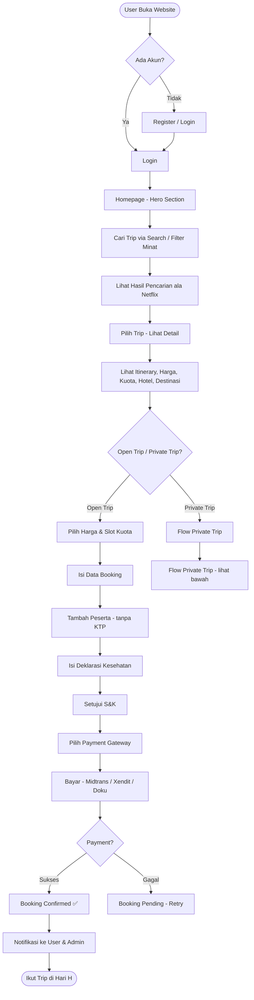
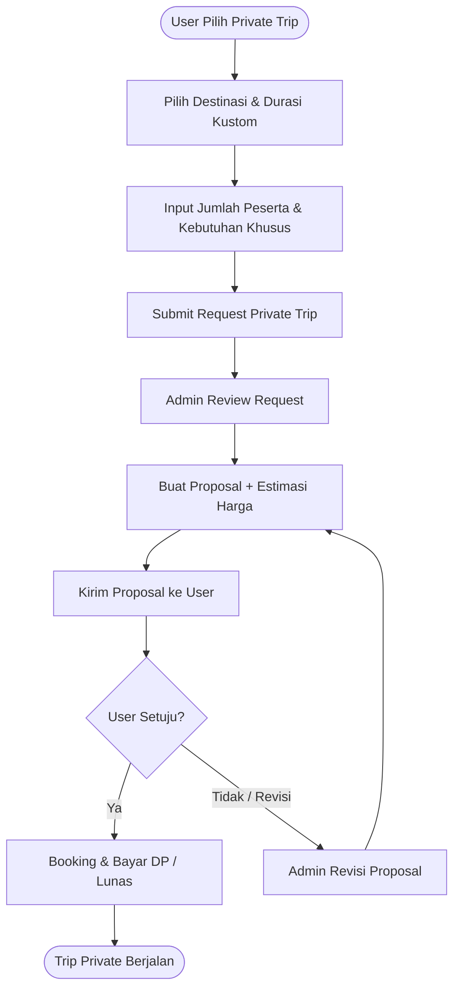
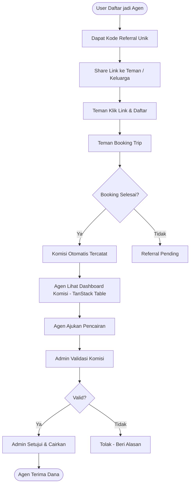
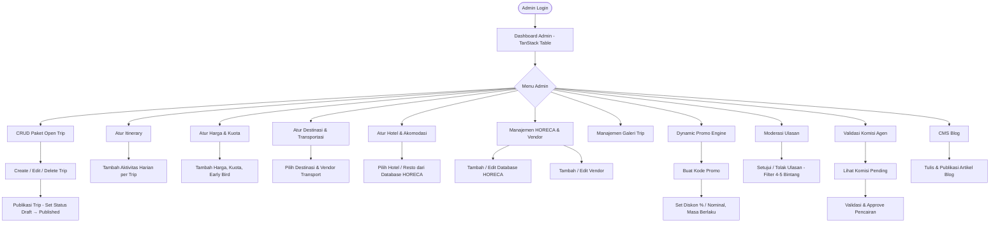
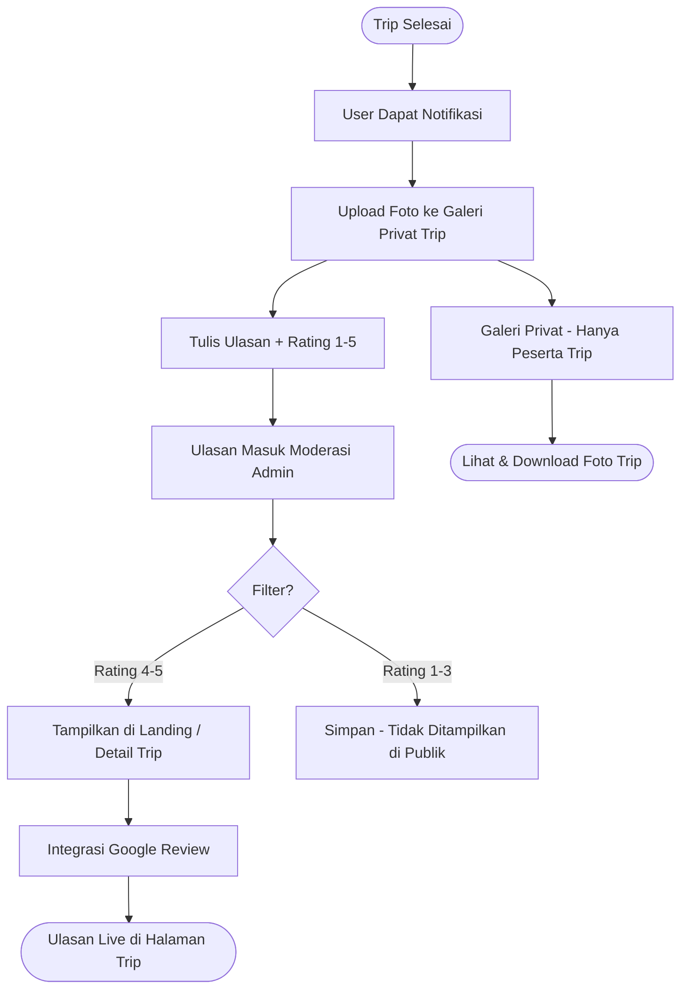
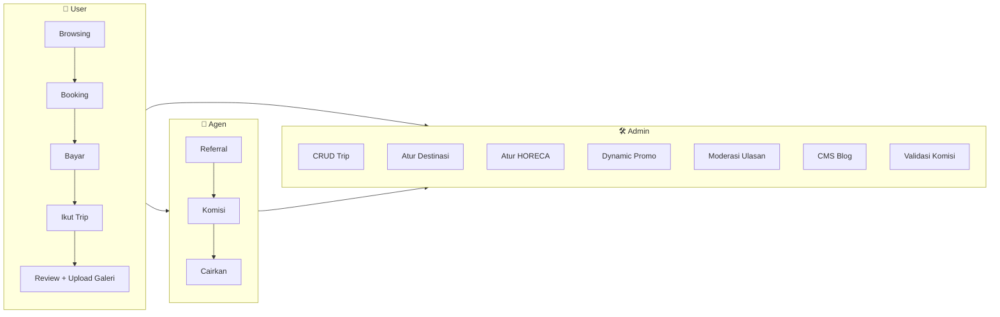

# ERD — Open Trip Lansia (OTL)

## 💠 Flow Diagram — Alur Sistem OTL

### 1️⃣ Flow User — Cari → Booking → Bayar

### 2️⃣ Flow Private Trip

### 3️⃣ Flow Agen — Referral → Komisi → Cair

### 4️⃣ Flow Admin — CRUD Trip + Manajemen

### 5️⃣ Flow Review & Galeri — Setelah Trip

### 6️⃣ Flow Gabungan — Sistem Utuh

---

**File:** `/home/ubuntu/ERD_OTL.md`
