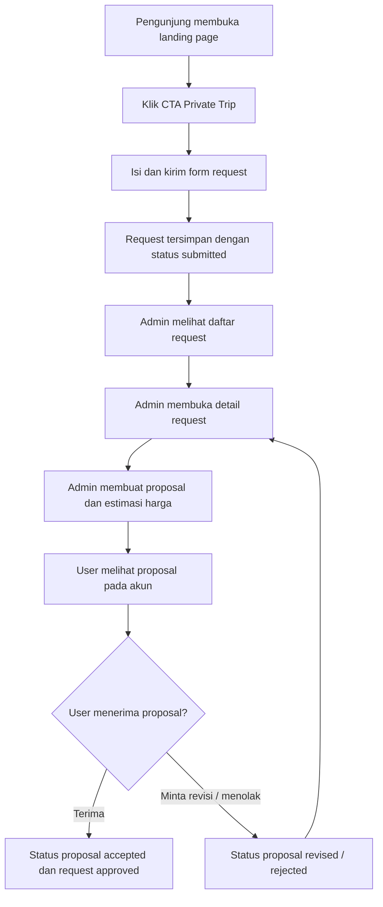

# TODO — Implementasi Fitur Private Trip

> **Tujuan:** melengkapi fitur *Private Trip* agar calon pelanggan dapat mengajukan perjalanan khusus dari landing page, lalu admin dapat meninjau, membuat proposal, dan memperbarui status pengajuan.
>
> **Target pelaksana:** junior programmer atau AI model berbiaya rendah.  
> **Prinsip:** kerjakan **satu tahap per sesi**, jangan mengubah fitur lain, dan jalankan verifikasi sebelum menandai tahap selesai.

---

## 0. Konteks dan kondisi saat ini

Fondasi Private Trip **sudah tersedia**, sehingga implementasi ini berfokus untuk melengkapinya, bukan membuat ulang dari nol.

### Yang sudah ada

- Halaman form pelanggan: `src/app/private-trip/page.tsx`
- Endpoint submit: `POST /api/private-trip`
- Modul berlapis:
  - `src/modules/private-trip/private-trip.schema.ts`
  - `src/modules/private-trip/private-trip.repository.ts`
  - `src/modules/private-trip/private-trip.service.ts`
  - `src/modules/private-trip/private-trip.controller.ts`
- Tabel/konsep database:
  - `private_trip_requests`
  - `private_trip_destinations_requested`
  - `private_trip_proposals`
- Link Private Trip di footer dan shortcut profil user.
- Opsi `private_trip` pada form paket trip admin.

### Kekurangan yang harus ditutup

1. Landing page belum memiliki CTA/section khusus yang mengarahkan pengunjung ke request Private Trip.
2. Admin belum mempunyai menu dan halaman untuk melihat request Private Trip.
3. Admin belum bisa membuat proposal, estimasi harga, atau memperbarui status request.
4. User belum bisa melihat riwayat request dan proposal Private Trip miliknya.
5. Endpoint submit saat ini mengambil `userId` dari header `x-user-id` dan memakai UUID fallback. Ini **tidak aman** dan harus diganti dengan session Better Auth.
6. Validasi input, otorisasi, state transition, error handling, dan test fitur belum lengkap.
7. Kolom harga masih berupa `varchar`; harus ditinjau agar konsisten dengan aturan uang `NUMERIC(14,2)`.

---

## 1. Definisi fitur selesai

Fitur dianggap selesai jika seluruh alur berikut dapat dilakukan:



### Kriteria penerimaan utama

- Pengunjung dapat menemukan CTA “Rencanakan Private Trip” dari landing page.
- User login dapat mengirim request Private Trip.
- Request selalu tersimpan atas akun user yang sedang login, bukan berdasarkan header buatan client.
- Admin dapat memfilter dan membuka seluruh request.
- Admin dapat mengubah status request sesuai aturan status.
- Admin dapat membuat proposal berisi harga, detail, fasilitas termasuk, dan fasilitas tidak termasuk.
- User hanya dapat melihat request dan proposal miliknya sendiri.
- User dapat menerima, menolak, atau meminta revisi proposal.
- Data harga disimpan dan ditampilkan dengan presisi uang yang benar.
- Data kebutuhan khusus tidak boleh muncul pada log atau audit log tanpa redaksi.
- Seluruh test terkait lulus, lint lulus, dan catatan progres diperbarui.

---

## 2. Keputusan produk yang harus dikonfirmasi sebelum coding

Jangan mulai Tahap 3 sebelum poin berikut dijawab oleh product owner/senior. Jika belum ada jawaban, gunakan nilai default yang ditandai.

| Pertanyaan | Pilihan / default sementara |
|---|---|
| Apakah pengunjung harus login untuk mengirim request? | **Default: wajib login**, karena request harus dapat dilacak dan proposal harus aman. |
| Apakah request boleh disimpan sebagai draft? | **Default: tidak pada MVP**. Form langsung mengirim status `submitted`. |
| Siapa yang boleh melihat kebutuhan khusus user? | **Default: hanya admin dengan role yang berwenang**. |
| Apakah user boleh mengubah request setelah submit? | **Default: tidak langsung**; gunakan status `revision` dan catatan revisi admin/user. |
| Apakah proposal dapat dibuat lebih dari satu kali? | **Default: ya**, setiap revisi membuat record proposal baru agar riwayat tidak hilang. |
| Bagaimana user diberi tahu saat proposal dibuat? | **MVP: tampil pada dashboard/profile**. Email/WhatsApp menjadi pekerjaan terpisah. |
| Apakah proposal yang disetujui langsung menjadi booking? | **Default: belum**. Konversi ke trip/booking dibuat sebagai tahap lanjutan setelah alur proposal stabil. |
| Apakah budget dari user wajib? | **Default: opsional**. Jika diisi, gunakan sebagai kisaran anggaran, bukan harga final. |

---

## 3. Urutan implementasi

> **Aturan pengerjaan:** selesaikan satu tahap, lakukan verifikasi, lalu baru lanjut ke tahap berikutnya.

---

## Tahap 1 — Persiapan dan verifikasi baseline

### Tujuan

Memastikan proyek sehat dan memahami pola yang sudah ada sebelum mengubah kode.

### Tugas

- [ ] Jalankan `pwd` dan pastikan root repository adalah `opentrip-lansia`.
- [ ] Baca:
  - [ ] `AGENTS.md`
  - [ ] `docs/PRD.md`
  - [ ] `docs/flow.md`
  - [ ] `docs/database/PANDUAN_DATABASE.md`
  - [ ] `design.md`
  - [ ] `feature_list.json`
  - [ ] `progress.md`
- [ ] Jalankan baseline:
  ```sh
  ./init.sh
  npm run lint
  npm test
  ```
- [ ] Catat hasil baseline pada `progress.md`.
- [ ] Periksa pola autentikasi Better Auth yang telah dipakai pada endpoint lain.
- [ ] Periksa pola halaman admin lain, terutama:
  - `src/app/admin/trips/`
  - `src/app/admin/promotions/`
  - `src/app/admin/reviews/`
- [ ] Periksa cara proyek membatasi akses admin dan akses user.

### Kriteria selesai

- Baseline diketahui: lulus atau ada kegagalan yang sudah dicatat.
- Pelaksana mengetahui pola auth, API route, tabel admin, dan modal/form yang digunakan proyek.
- Jangan meneruskan fitur baru jika baseline rusak karena masalah yang belum dicatat.

---

## Tahap 2 — Rapikan kontrak data dan database Private Trip

### Tujuan

Membuat data model aman, konsisten, dan cukup untuk alur request → proposal → keputusan user.

### File utama

- `src/db/schema/private_trip.ts`
- `src/modules/private-trip/private-trip.schema.ts`
- File migrasi baru di `drizzle/`
- Berkas ekspor schema jika diperlukan oleh proyek

### Tugas

- [ ] Bandingkan schema Drizzle dengan referensi:
  - `docs/index.md`
  - `docs/database/erd_revisi.mermaid`
- [ ] Pastikan model request memiliki status terbatas berikut:
  - `draft`
  - `submitted`
  - `reviewed`
  - `approved`
  - `rejected`
  - `revision`
- [ ] Pastikan model proposal memiliki status terbatas berikut:
  - `pending`
  - `accepted`
  - `rejected`
  - `revised`
- [ ] Ubah kolom nominal berikut dari string menjadi tipe numerik Drizzle yang sesuai dengan `NUMERIC(14,2)`:
  - [ ] `privateTripRequests.budgetEstimate`
  - [ ] `privateTripProposals.estimatedPrice`
- [ ] Gunakan UUIDv7 bila proyek telah memiliki pola UUIDv7 yang konsisten.
  - Jangan membuat pola ID baru yang berbeda sendiri.
- [ ] Tambahkan foreign key yang masih diperlukan:
  - [ ] `private_trip_requests.user_id` → tabel user.
  - [ ] `private_trip_proposals.admin_id` → tabel user/admin.
  - [ ] `private_trip_destinations_requested.destination_id` → tabel destination bila schema destination tersedia.
- [ ] Tambahkan constraint untuk destinasi:
  - tepat satu dari `destination_id` atau `custom_destination` wajib diisi.
- [ ] Tambahkan index minimal:
  - [ ] `(user_id, created_at)` untuk dashboard user.
  - [ ] `(status, submitted_at)` untuk daftar request admin.
  - [ ] `(request_id, created_at)` untuk proposal per request.
- [ ] Tentukan apakah `special_requirements` perlu diberi label sebagai data sensitif.
  - Jangan menyimpan isi kebutuhan medis secara plaintext di audit log.
  - Jangan menampilkan data tersebut di daftar admin; tampilkan hanya pada halaman detail untuk admin berwenang.

### Kriteria selesai

- Schema Drizzle sesuai kebutuhan fitur.
- Migrasi database dapat dibuat dan dijalankan.
- Tidak ada harga yang disimpan sebagai `float`, `double`, atau string bebas.
- Constraint destinasi dan index utama tersedia.

### Verifikasi

```sh
npm run lint
npm test
```

Tambahkan test schema/repository bila pola test proyek mendukungnya.

---

## Tahap 3 — Perbaiki API submit request untuk user

### Tujuan

Membuat endpoint request Private Trip tervalidasi dan aman.

### File utama

- `src/app/api/private-trip/route.ts`
- `src/modules/private-trip/private-trip.controller.ts`
- `src/modules/private-trip/private-trip.service.ts`
- `src/modules/private-trip/private-trip.repository.ts`

### Tugas

- [ ] Hapus penggunaan UUID fallback:
  ```ts
  "00000000-0000-0000-0000-000000000000"
  ```
- [ ] Jangan lagi percaya header `x-user-id` dari browser.
- [ ] Ambil user dari session Better Auth di server.
- [ ] Jika user belum login, endpoint harus mengembalikan `401 Unauthorized`.
- [ ] Validasi body request di server.
  - Gunakan library yang sudah dipakai proyek. Jika belum ada, buat validasi TypeScript sederhana terlebih dahulu; jangan menambah dependency tanpa alasan.
- [ ] Validasi minimum:
  - [ ] `title`: wajib, panjang wajar.
  - [ ] `durationDays`: integer, minimal 1.
  - [ ] `participantsCount`: integer, minimal 1.
  - [ ] `destinationPreferences`: wajib bila belum menggunakan tabel destinasi request.
  - [ ] `budgetEstimate`: opsional, tetapi harus nominal valid dan tidak negatif.
  - [ ] `specialRequirements`: opsional dengan batas panjang.
- [ ] Simpan request baru dengan:
  - `status = "submitted"`
  - `submittedAt = new Date()`
  - `userId` dari session server.
- [ ] Kembalikan respons aman:
  - `201 Created` saat sukses.
  - ID, status, dan tanggal request boleh dikembalikan.
  - Jangan mengembalikan data internal yang tidak perlu.
- [ ] Tambahkan error message yang dapat dipahami user.
- [ ] Buat endpoint user untuk membaca request miliknya:
  - `GET /api/private-trip`
  - Hanya mengambil data berdasarkan user pada session.
- [ ] Buat endpoint user untuk membaca detail satu request:
  - `GET /api/private-trip/[id]`
  - Pastikan request tersebut milik user login.

### Kriteria selesai

- User yang belum login tidak dapat mengirim request.
- User login dapat mengirim request valid.
- Request tersimpan dengan pemilik yang benar.
- User tidak dapat membaca request user lain.
- Input invalid menghasilkan `400 Bad Request`, bukan error server.

### Test minimal

- [ ] POST tanpa session → `401`.
- [ ] POST dengan input kosong/invalid → `400`.
- [ ] POST valid → `201`, request tersimpan dengan `submitted`.
- [ ] GET request user hanya mengembalikan request miliknya.
- [ ] GET detail milik user lain → `403` atau `404`, sesuai konvensi proyek.

### Verifikasi

```sh
npm run lint
npm test
```

---

## Tahap 4 — Tambahkan CTA Private Trip pada landing page

### Tujuan

Membuat pengunjung mengetahui bahwa mereka dapat meminta perjalanan privat.

### File utama

- `src/app/page.tsx`
- Bila perlu, komponen baru yang kecil di `src/components/`

### Desain yang diharapkan

Tambahkan satu section CTA setelah section daftar destinasi atau sebelum testimonial/newsletter.

Konten minimum:

- Badge: `PRIVATE TRIP`
- Judul: `Punya Rencana Perjalanan untuk Rombongan Sendiri?`
- Deskripsi singkat: `Tentukan destinasi, durasi, jumlah peserta, dan kebutuhan perjalanan Anda. Tim kami akan menyiapkan proposal terbaik.`
- Tiga poin manfaat:
  - Itinerary fleksibel.
  - Pendampingan sesuai kebutuhan lansia.
  - Estimasi harga transparan.
- Tombol utama: `Rencanakan Private Trip`
- Tombol harus menuju `/private-trip`.

### Tugas

- [ ] Gunakan komponen `Link` dari Next.js, bukan `<a>` biasa.
- [ ] Gunakan warna dan gaya sesuai `design.md`:
  - CTA utama oranye `#E06D26`.
  - Hover `#C85B18`.
  - Sudut rounded dan teks berkontras tinggi.
- [ ] Pastikan section responsif untuk mobile dan desktop.
- [ ] Gunakan ukuran teks dan tombol yang mudah dibaca lansia.
- [ ] Pastikan CTA dapat dinavigasi menggunakan keyboard.
- [ ] Jangan memasukkan gambar eksternal baru bila tidak dibutuhkan.
- [ ] Tambahkan test bahwa landing page memiliki link menuju `/private-trip`.

### Kriteria selesai

- CTA tampil di landing page.
- CTA dapat diklik dan mengarah ke `/private-trip`.
- Tampilan tetap baik pada mobile dan desktop.
- Tidak ada perubahan tidak terkait pada landing page.

### Verifikasi

```sh
npm run lint
npm test
```

Lakukan cek manual di browser pada ukuran mobile dan desktop.

---

## Tahap 5 — Sempurnakan halaman form request Private Trip

### Tujuan

Membuat form request mudah dipakai, jelas, dan tahan terhadap kegagalan API.

### File utama

- `src/app/private-trip/page.tsx`

### Tugas

- [ ] Sesuaikan visual form dengan design system proyek:
  - warna oranye utama,
  - border `slate`,
  - teks kontras,
  - tombol besar dan mudah ditekan.
- [ ] Tambahkan penjelasan singkat di atas form:
  - request akan ditinjau admin,
  - harga final diberikan melalui proposal,
  - request belum merupakan booking/pembayaran.
- [ ] Tambahkan field anggaran opsional:
  - label: `Kisaran Anggaran (Opsional)`.
  - tampilkan sebagai rupiah di UI.
  - kirim nilai numerik bersih ke API.
- [ ] Pertimbangkan field kontak hanya bila belum tersedia dari profil user.
  - Jangan duplikasi data jika profil user sudah menjadi sumber kebenaran.
- [ ] Buat validasi client-side untuk membantu user, tetapi tetap pertahankan validasi server-side.
- [ ] Tampilkan error API pada halaman, jangan diam-diam gagal.
- [ ] Tampilkan status sukses setelah submit.
- [ ] Setelah sukses, arahkan user ke:
  - **preferensi:** `/profile?tab=private-trip`, atau
  - halaman detail request baru jika sudah dibuat.
- [ ] Jangan lagi mengarahkan ke `/trips`, karena ini membingungkan setelah submit request.
- [ ] Cegah klik ganda saat request sedang dikirim.
- [ ] Pastikan field kebutuhan khusus tidak dipaksa diisi.

### Kriteria selesai

- Form menyampaikan ekspektasi alur kepada user.
- User mendapat feedback berhasil/gagal yang jelas.
- Request sukses tidak mengarahkan user ke halaman daftar Open Trip.
- Error jaringan/API tidak membuat tombol loading selamanya.

### Test minimal

- [ ] Field wajib tervalidasi.
- [ ] Submit sukses menampilkan feedback/redirect yang tepat.
- [ ] Submit gagal menampilkan pesan error.
- [ ] Tombol disabled selama proses submit.

### Verifikasi

```sh
npm run lint
npm test
```

---

## Tahap 6 — Buat halaman daftar dan detail Private Trip di admin

### Tujuan

Admin dapat melihat dan memproses request yang masuk.

### File baru yang diperkirakan

- `src/app/admin/private-trips/page.tsx`
- `src/app/admin/private-trips/[id]/page.tsx`
- Komponen lokal di `src/app/admin/private-trips/` bila diperlukan.
- Tambahan API route admin pada `src/app/api/private-trip/`.

### Tugas API admin

- [ ] Buat endpoint daftar request untuk admin:
  - `GET /api/private-trip/admin`
- [ ] Endpoint harus memeriksa role admin di server.
- [ ] Dukungan filter:
  - status,
  - kata kunci judul/destinasi,
  - rentang tanggal jika mudah diimplementasikan.
- [ ] Dukungan pagination bila pola admin lain sudah memilikinya.
- [ ] Buat endpoint detail request admin:
  - `GET /api/private-trip/admin/[id]`
- [ ] Respons detail harus berisi:
  - data request,
  - pemilik request secukupnya,
  - daftar destinasi,
  - riwayat proposal.
- [ ] Batasi data sensitif pada role yang tepat.

### Tugas UI admin

- [ ] Tambahkan menu sidebar:
  - Nama: `Private Trip`
  - URL: `/admin/private-trips`
  - Gunakan ikon `Users`, `Compass`, atau ikon Lucide yang relevan.
- [ ] Buat tabel request dengan kolom:
  - ID/request code singkat,
  - judul perjalanan,
  - nama user,
  - jumlah peserta,
  - durasi,
  - tanggal submit,
  - status,
  - aksi `Lihat Detail`.
- [ ] Tambahkan badge status dengan warna yang konsisten:
  - `submitted`: kuning/oranye,
  - `reviewed`: biru,
  - `revision`: ungu,
  - `approved`: hijau,
  - `rejected`: merah/abu.
- [ ] Buat halaman detail admin berisi:
  - informasi request,
  - daftar destinasi/keinginan user,
  - kebutuhan khusus,
  - budget estimate bila ada,
  - riwayat proposal,
  - aksi update status,
  - form proposal.
- [ ] Jangan tampilkan data kebutuhan khusus pada tabel daftar; hanya di detail.
- [ ] Gunakan pola table/modal/form dari halaman admin yang sudah ada.
- [ ] Jangan membuat admin layout baru.

### Kriteria selesai

- Hanya admin yang bisa membuka halaman dan API admin.
- Admin dapat melihat daftar request dan membuka detailnya.
- Filter status berfungsi.
- User biasa tidak bisa melihat request user lain melalui endpoint admin.

### Test minimal

- [ ] User biasa mengakses endpoint admin → `403`.
- [ ] Admin mendapat daftar request.
- [ ] Tabel admin menampilkan empty state bila belum ada request.
- [ ] Filter status mengubah hasil yang ditampilkan.

### Verifikasi

```sh
npm run lint
npm test
```

---

## Tahap 7 — Implementasi proposal dan perubahan status oleh admin

### Tujuan

Admin bisa memberikan estimasi serta proposal yang dapat ditinjau user.

### Aturan status

Gunakan aturan berikut agar state tidak berubah sembarangan:

| Status request saat ini | Aksi | Status request setelah aksi |
|---|---|---|
| `submitted` | Admin mulai meninjau | `reviewed` |
| `submitted` / `reviewed` / `revision` | Admin mengirim proposal | `reviewed` |
| `reviewed` | User menerima proposal | `approved` |
| `reviewed` | User meminta revisi | `revision` |
| `reviewed` | User/admin menolak | `rejected` |
| `approved` / `rejected` | Perubahan biasa | Tidak boleh tanpa keputusan senior |

### Tugas

- [ ] Tambahkan method repository:
  - membuat proposal,
  - mengambil proposal per request,
  - memperbarui status request,
  - memperbarui status proposal.
- [ ] Tambahkan service layer untuk memastikan transisi status valid.
- [ ] Jangan mengubah status langsung dari controller tanpa validasi service.
- [ ] Buat endpoint admin membuat proposal:
  - `POST /api/private-trip/admin/[id]/proposals`
- [ ] Data proposal minimum:
  - `proposalContent`,
  - `estimatedPrice`,
  - `inclusions`,
  - `exclusions`.
- [ ] Ambil `adminId` dari session server, bukan dari body request.
- [ ] Simpan harga dengan tipe numerik yang benar.
- [ ] Saat proposal dibuat:
  - proposal berstatus `pending`,
  - request menjadi `reviewed` bila sebelumnya `submitted`.
- [ ] Buat endpoint admin untuk update status request bila memang dibutuhkan:
  - `PATCH /api/private-trip/admin/[id]`
- [ ] Tulis audit log jika infrastruktur audit log sudah ada.
  - Redaksi data kebutuhan khusus/medis.
  - Jangan log data pribadi secara lengkap.

### Kriteria selesai

- Admin dapat membuat proposal valid.
- Proposal selalu mempunyai admin pembuat.
- Harga tidak memakai floating point.
- Perubahan status mengikuti tabel aturan status.
- Admin tidak dapat mengubah request yang sudah final tanpa aturan khusus.

### Test minimal

- [ ] Hanya admin dapat membuat proposal.
- [ ] Proposal valid tersimpan.
- [ ] Harga invalid ditolak.
- [ ] Status `submitted` berubah menjadi `reviewed` saat proposal dikirim.
- [ ] Perubahan status terlarang menghasilkan error yang jelas.

### Verifikasi

```sh
npm run lint
npm test
```

---

## Tahap 8 — Buat dashboard Private Trip untuk user

### Tujuan

User dapat melacak request dan menanggapi proposal tanpa perlu menghubungi admin secara manual.

### File yang diperkirakan

- Tambahan pada `src/app/profile/page.tsx`
- Tambahan pada `src/app/profile/profile-client.tsx`
- Atau halaman dedicated:
  - `src/app/private-trip/my-requests/page.tsx`
  - `src/app/private-trip/[id]/page.tsx`

> Gunakan pola yang paling dekat dengan struktur profil yang sudah ada. Jangan menduplikasi UI bila tab `Private Trip Saya` di profil dapat digunakan.

### Tugas

- [ ] Hubungkan tab `Private Trip Saya` yang sudah ada dengan data nyata.
- [ ] Tampilkan daftar request milik user:
  - judul,
  - tanggal submit,
  - jumlah peserta,
  - status,
  - harga proposal bila tersedia,
  - tombol detail.
- [ ] Buat halaman/detail request user.
- [ ] Tampilkan proposal dan riwayat revisi dengan urutan terbaru terlebih dahulu.
- [ ] Tambahkan aksi user pada proposal berstatus `pending`:
  - `Terima Proposal`
  - `Minta Revisi`
  - `Tolak Proposal`
- [ ] Jika memilih revisi, tampilkan textarea alasan revisi.
- [ ] Buat endpoint aksi user:
  - `PATCH /api/private-trip/[id]/proposal`
  - atau struktur route yang mengikuti konvensi proyek.
- [ ] Pastikan:
  - user hanya bisa merespons proposal request miliknya,
  - user hanya bisa merespons proposal `pending`,
  - aksi final tidak dapat dikirim dua kali.
- [ ] Setelah proposal diterima:
  - ubah proposal menjadi `accepted`,
  - ubah request menjadi `approved`.
- [ ] Tampilkan informasi jelas:
  - “Proposal diterima. Tim kami akan menghubungi Anda untuk proses booking dan pembayaran.”
- [ ] Jangan implementasikan pembayaran atau pembuatan booking otomatis dalam tahap ini.

### Kriteria selesai

- User dapat melihat request miliknya sendiri.
- User dapat melihat proposal yang dikirim admin.
- User dapat menerima, menolak, atau meminta revisi proposal.
- User tidak dapat mengakses atau mengubah request milik orang lain.
- Status request/proposal berubah konsisten.

### Test minimal

- [ ] Dashboard hanya menampilkan request user login.
- [ ] User tidak bisa membuka request user lain.
- [ ] User bisa menerima proposal pending.
- [ ] Proposal yang sudah diterima tidak dapat diterima ulang.
- [ ] User dapat mengirim alasan revisi.

### Verifikasi

```sh
npm run lint
npm test
```

---

## Tahap 9 — Aksesibilitas, keamanan, dan kualitas UX

### Tujuan

Memastikan fitur layak digunakan oleh target pengguna, termasuk lansia dan pendampingnya.

### Tugas aksesibilitas

- [ ] Semua input punya `<label>` yang jelas.
- [ ] Error validasi dikaitkan dengan input terkait.
- [ ] Kontras teks dan tombol memenuhi prinsip di `design.md`.
- [ ] Tombol CTA memiliki area klik cukup besar.
- [ ] Jangan hanya membedakan status melalui warna; sertakan teks status.
- [ ] Semua form dapat digunakan dengan keyboard.
- [ ] Pastikan halaman responsif pada mobile.
- [ ] Gunakan bahasa Indonesia yang singkat dan mudah dipahami.

### Tugas keamanan

- [ ] Semua endpoint menegakkan autentikasi di server.
- [ ] Endpoint admin menegakkan role admin di server.
- [ ] Jangan percaya `userId`, `adminId`, atau `status` dari browser.
- [ ] Validasi semua input API.
- [ ] Jangan memakai UUID fallback untuk user yang belum login.
- [ ] Jangan menyimpan data kebutuhan khusus sensitif ke log biasa.
- [ ] Jangan menampilkan data kebutuhan khusus di daftar/table yang dapat dilihat banyak admin.
- [ ] Pastikan error API tidak membocorkan stack trace atau detail database.

### Kriteria selesai

- Semua poin keamanan di atas telah diperiksa.
- Semua halaman tetap bisa digunakan pada mobile.
- Tidak ada data user yang dapat diakses oleh user/admin tidak berwenang.

---

## Tahap 10 — Pengujian akhir dan dokumentasi

### Tugas test

Tambahkan atau perbarui test untuk:

- [ ] Private Trip form user.
- [ ] CTA landing page menuju `/private-trip`.
- [ ] API submit request.
- [ ] Autentikasi dan otorisasi user.
- [ ] Daftar/detail request admin.
- [ ] Pembuatan proposal admin.
- [ ] Keputusan proposal oleh user.
- [ ] Validasi state transition.
- [ ] Empty state dan error state UI.

### Skenario manual wajib

- [ ] Pengunjung membuka landing page → klik CTA → sampai ke form Private Trip.
- [ ] User belum login membuka form → diminta login sebelum submit.
- [ ] User login mengirim request valid → melihat status `submitted`.
- [ ] Admin melihat request baru → membuka detail → mengirim proposal.
- [ ] User melihat proposal → meminta revisi.
- [ ] Admin mengirim proposal revisi.
- [ ] User menerima proposal → request menjadi `approved`.
- [ ] User A tidak dapat melihat request User B.
- [ ] User biasa tidak dapat membuka halaman admin.

### Perintah verifikasi akhir

```sh
./init.sh
npm run lint
npm test
npm run build
```

> Jika salah satu perintah gagal, jangan menandai fitur selesai. Catat error di `progress.md`.

### Dokumentasi dan artefak proyek

- [ ] Tambahkan fitur Private Trip ke `feature_list.json`.
- [ ] Tetapkan dependency fitur, contoh:
  - baseline (`feat-001`) harus lulus,
  - auth user (`feat-021`) harus tersedia,
  - admin layout (`feat-040`) harus tersedia.
- [ ] Tambahkan hasil verifikasi, file yang berubah, dan risiko tersisa ke `progress.md`.
- [ ] Perbarui dokumentasi API bila proyek memiliki dokumentasi endpoint.
- [ ] Jangan commit jika user tidak meminta commit.

---

## 4. Pembagian pekerjaan yang aman untuk beberapa sesi

| Sesi | Lingkup | Jangan dikerjakan pada sesi yang sama |
|---|---|---|
| 1 | Baseline, audit schema, keputusan produk | UI admin dan user |
| 2 | Migrasi/schema dan repository | Landing page |
| 3 | Auth + submit request API + test API | Proposal admin |
| 4 | CTA landing + perbaikan form user | Dashboard admin |
| 5 | Daftar/detail request admin | Aksi proposal user |
| 6 | Form proposal + state transition admin | Konversi booking |
| 7 | Dashboard user + respons proposal | Payment gateway |
| 8 | QA, aksesibilitas, dokumentasi | Fitur di luar Private Trip |

---

## 5. Di luar scope fitur ini

Jangan dikerjakan kecuali ada instruksi baru:

- Payment gateway untuk Private Trip.
- Konversi otomatis proposal menjadi booking.
- Pembuatan trip itinerary lengkap secara otomatis dari proposal.
- Notifikasi WhatsApp/email/realtime.
- Chat antara admin dan user.
- Sistem harga otomatis berdasarkan vendor/HORECA.
- Perubahan besar pada modul Open Trip yang sudah ada.
- Refactor seluruh sistem auth/admin yang tidak dibutuhkan langsung untuk Private Trip.

---

## 6. Risiko yang harus diperhatikan

| Risiko | Mitigasi |
|---|---|
| User ID dapat dipalsukan dari header client | Gunakan session Better Auth di server. |
| User melihat request user lain | Selalu filter dengan user ID session dan lakukan ownership check pada detail/action. |
| User biasa masuk ke API admin | Periksa role admin di server pada setiap route admin. |
| Status request tidak konsisten | Semua transisi status harus melalui service layer. |
| Harga meleset karena float/string | Gunakan `NUMERIC(14,2)` dan formatter Rupiah. |
| Data kebutuhan khusus bocor | Batasi role, redaksi audit log, jangan tampilkan di tabel ringkasan. |
| Request/proposal diubah setelah final | Larang perubahan pada status final kecuali ada proses khusus yang disetujui senior. |
| Implementasi terlalu besar dalam satu perubahan | Ikuti pembagian tahap dan lakukan test per tahap. |

---

## 7. Catatan untuk pelaksana

1. Baca `AGENTS.md` sebelum mengubah kode.
2. Jangan membuat dependency baru sebelum memeriksa `package.json`.
3. Gunakan pola modul yang sudah ada: `schema → repository → service → controller → route`.
4. Jangan memindahkan atau merombak file yang tidak relevan.
5. Jika requirement bisnis tidak jelas, hentikan pada titik keputusan dan tanyakan senior/product owner.
6. Jangan klaim selesai tanpa hasil nyata dari `npm run lint` dan `npm test`.
7. Sebelum mengakhiri sesi, selalu perbarui `progress.md` dan `feature_list.json`.
